# EA 使用经验总结

## 使用前设置

### EA 统一设置用户名

EA中生成的每个图标都有自己的属主，默认情况是系统的登录用户名，如果想要统一进行修改，可以安装如下操作进行修改

Start---> Preferences --> General ---> 修改Author 的取值为自己的名字即可。

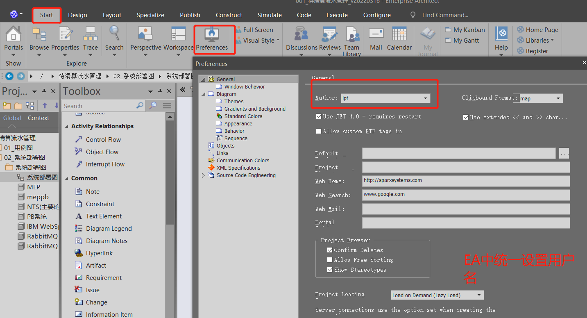

### 为某个Diagram 单独设置作者信息

### EA 发布要生成的UML 为PDF 格式的文件

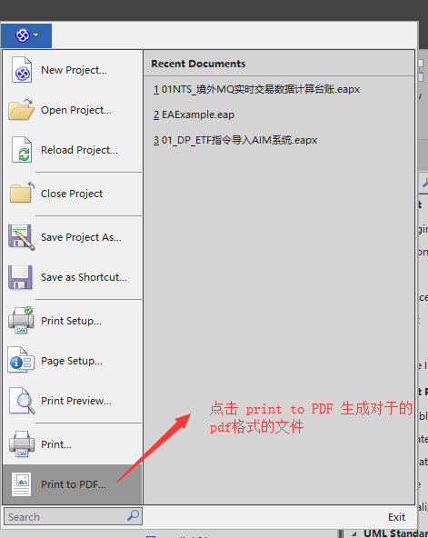

###  EA 中绘制折线， 通过Ctrl + Q 快捷键来实现。 

### 在Action之间添加描述

使用EA汇总UML 图的时候，如果想要在两个Action 之间的连线上添加描述，效果如下：

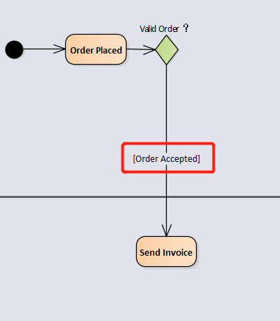

相关的操作如下：

右击 相关的线条，选择【properties】 属性， 

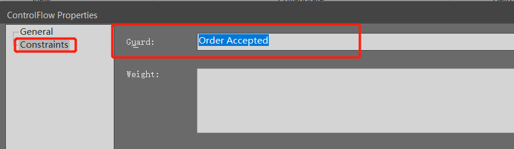

在弹出的弹出框的Constraints 的Guard 中添加相关的描述

 

 

1. 想要查看其它人的某些效果是如何实现的，可以通过右键相关组件，查看属性，看看修改了哪些属性。 

2. 绘制连接两个Action 之间连线的方法：

   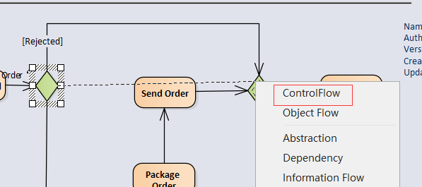

选中箭头开始的Action ，然后将箭头拉到终止的Action， 然后右键弹出如图所示，选择 ControlFlow ，然后将汇总的图线通过Ctrl +  Q 进行折角的调整，按照ctrl + Q, 然后在线条上会出现小方块，移动小方块到知道位置，然后放开ctrl + q 和鼠标，就建好一个折角了。 

### 设置Note元素的显示

\1. Note 的外观是可选择的，

选择Note 元素，右键，选择Apperaence， 然后选择你想要的效果

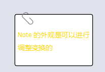

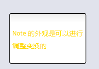

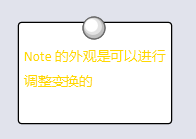

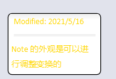

设置多个节点为一个整体

设置多个节点为一个整体，便于移动，而不会影响原有的结构和布局

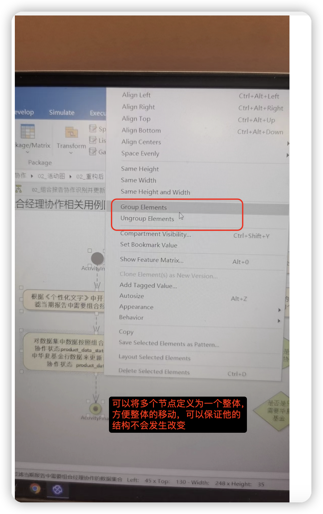

## 在EA中打开我的电脑

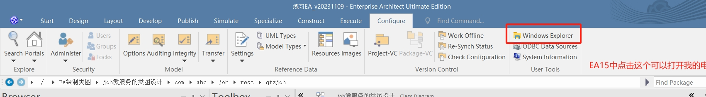

