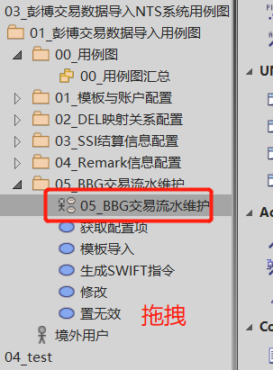
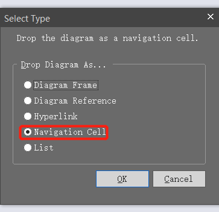
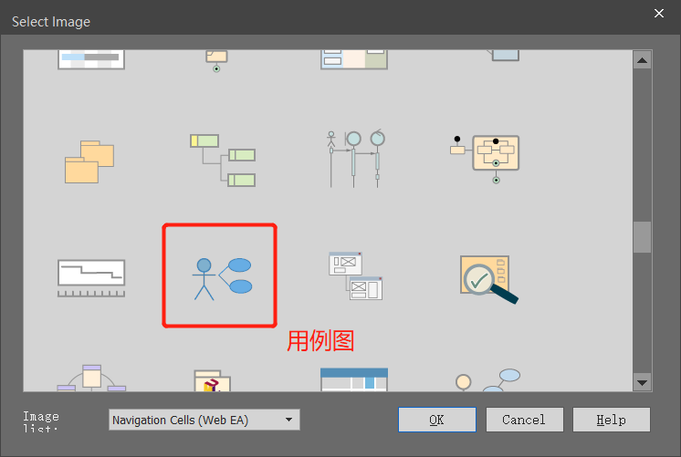
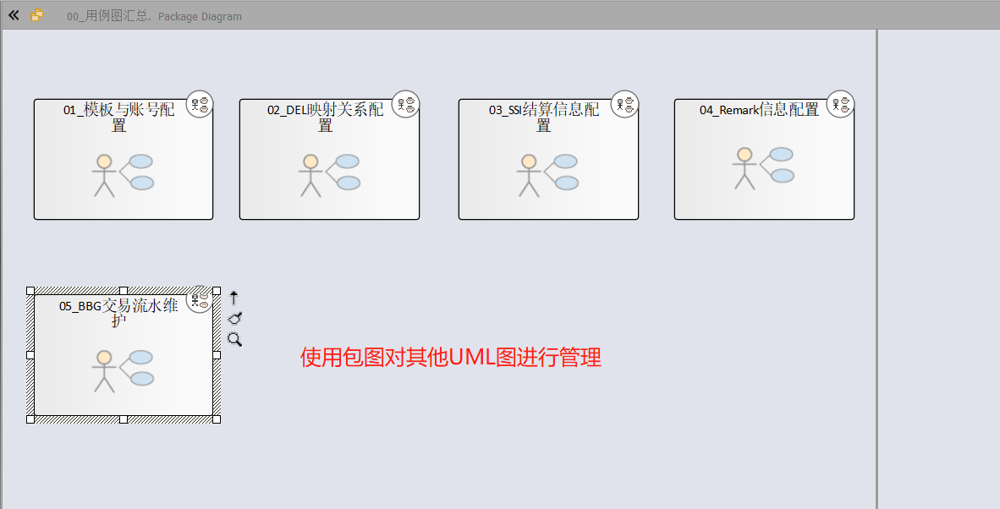
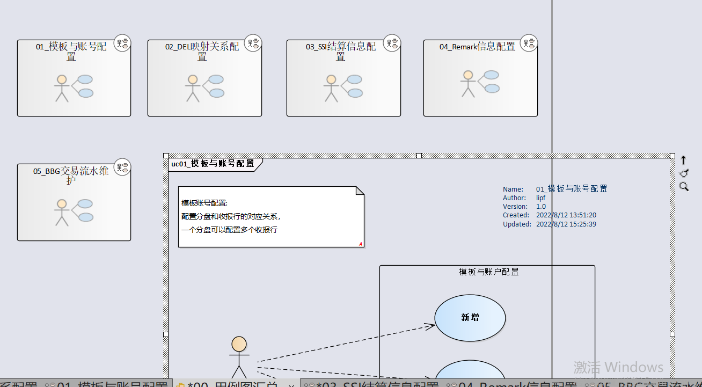
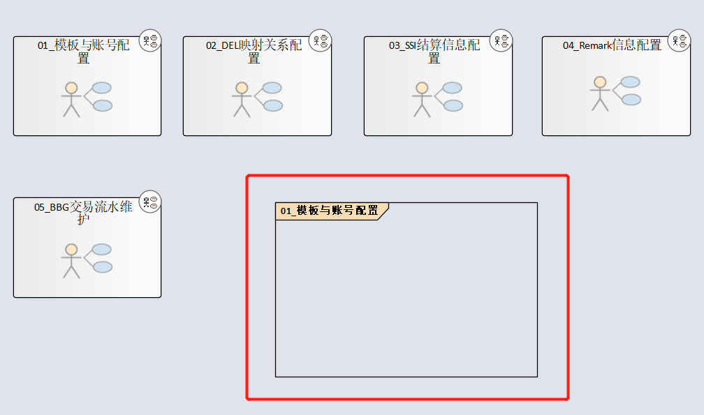
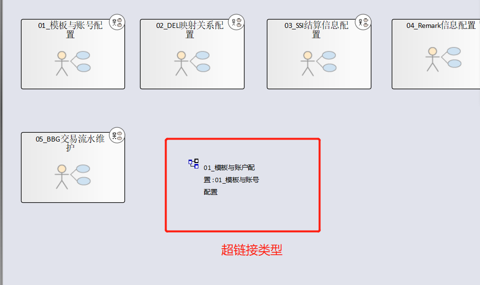
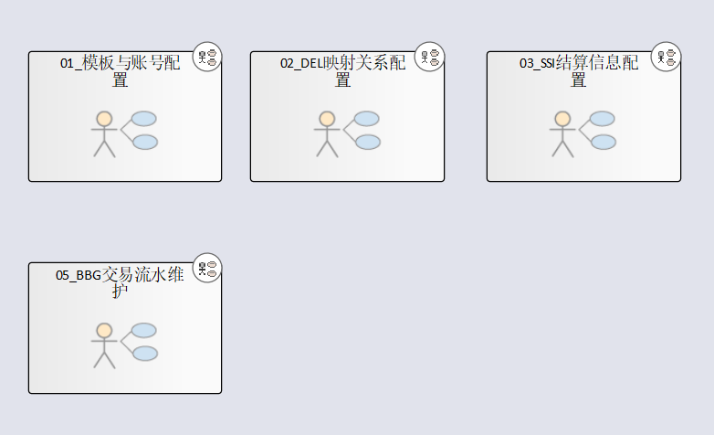
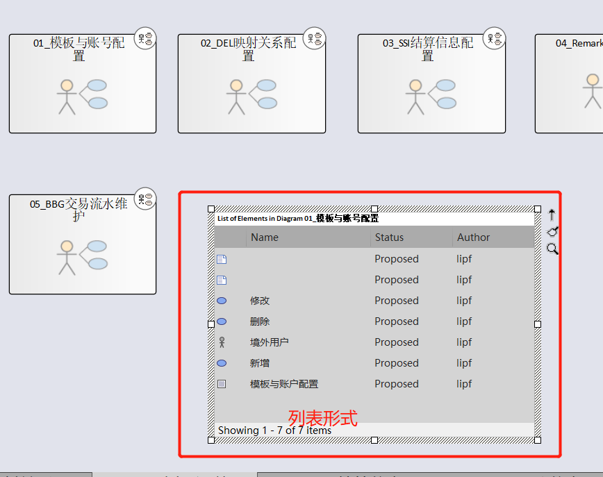

# EA中使用包图对 分散的Diagram进行管理

## 操作步骤

1.  新建一个Diagram，类型为Package。 

2. 将创建好的用例图(获取其他UML图)的Diagram 拖拽到创建好的包图中

   

3. 效果如下 

这里选择 【Navigation Cell】 

选中之后，会让选择对应的图标，这里根据Diagram的类型进行选择，我这里选择的是用例图。

选择之后，效果如下：

## 不同类型的差异

* Diagram Frame

* DIagram Reference

* Hyperlink

* Navigation Cell(导航单元)

* List

不同的Diagram在包图中的展示形式有多种。上面我们

### Diagram Frame 

diagram Frame 会将其他UML 的Diagram 里面的内容全部展示在package 中， 效果如 uc01_模板与账户配置

### DIagram Reference

效果如 01_模板与账号配置。 双击可以跳转到特定的UML图中。 

 同样，可以通过双击跳转到指定的UML图

### Hyperlink

双击可以跳转到指定的UML图中

### Navigation Cell(导航单元)

### List

这种形式，无法跳转到目标的UML图

