# 使用EA绘制类图并且生成对应的源码

**使用EA的版本：Enterprise Architect 15** 

​		使用EA可以绘制UML中的类图，从而 进行类和接口的设计，并且可以通过设计好的类图生成对应的类和接口。 

# 操作步骤

在EA中组织类，一般是 RootNode--> View ---> package --> class/interface

1. 在EA的Browser面板中，右键，选择Root Node 如下图：

   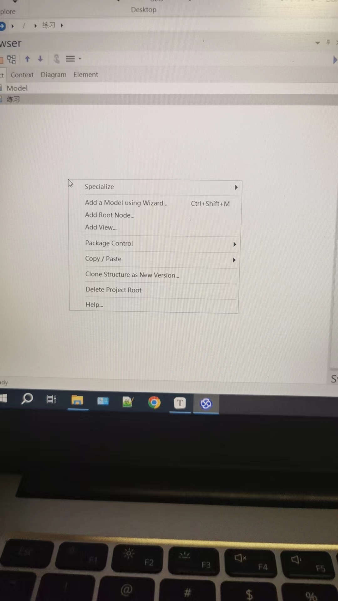

   

2. 选择 Add Root Node ，如下图

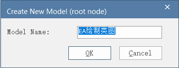

效果如下:

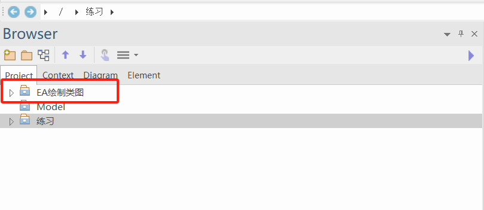

之后选中该Root Node ， 右键选择 【Add View】

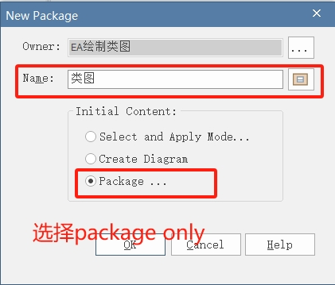

之后右键选择【Add package】，根据自己包的层级，多次进行添加效果如下

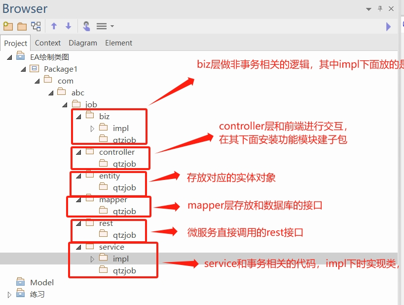

全部展开效果如下：

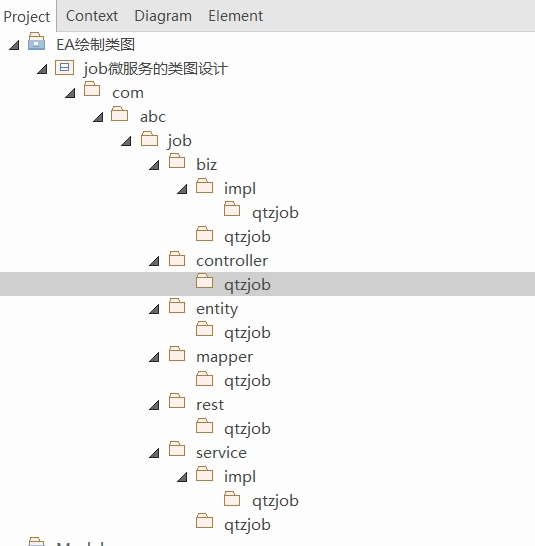

接下来创建Diagram

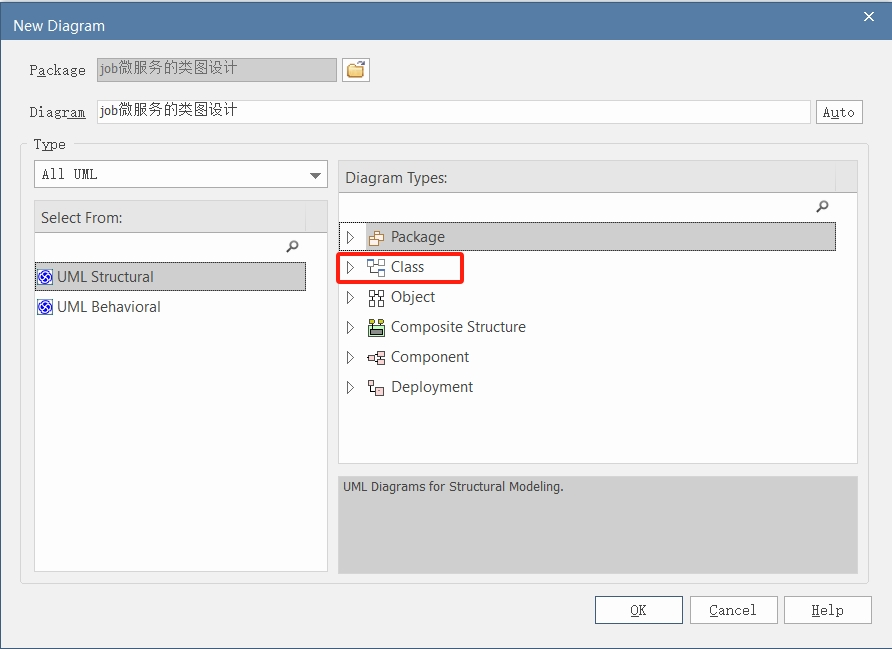

下面是创建好的类图

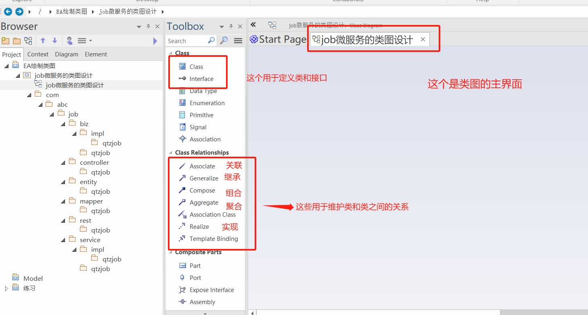

之后就可以利用Toolbox里面的工具来创建类和接口，并且维护类类之间的关系

下面我们创建一个类

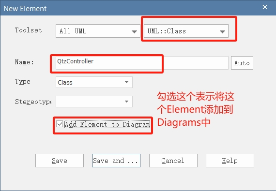

这里如果选择[Save] 则说明保存并且继续创建下一个，

如果选择【Save and ....】 , 则说明保存并且退出。

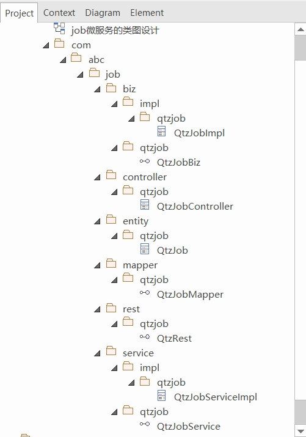

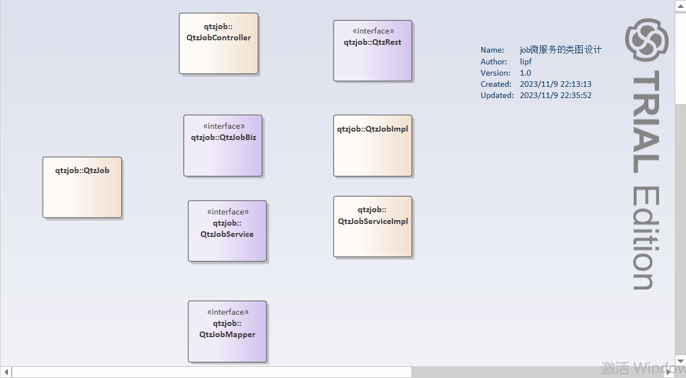

接下来，我们可以维护这些类和接口之间的关系。

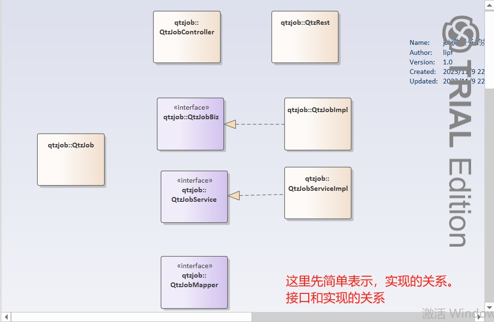

之后，我们可以为这些类转换为java代码或者其他语言代码。

可以按照如图所示来【Generate】-【Generate All】来生成代码，或者直接通过快捷键 【 Ctrl +Alt  + K】

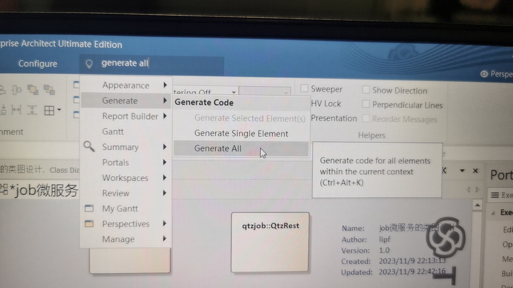

指定为哪些类生成java代码

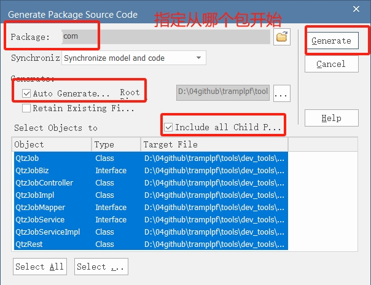

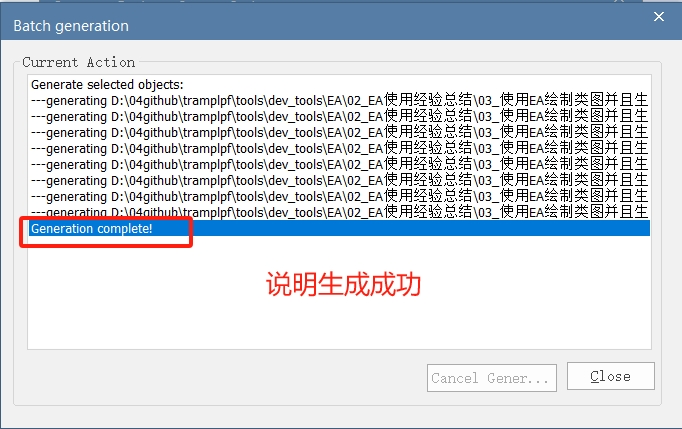

自动生成的代码如图所示

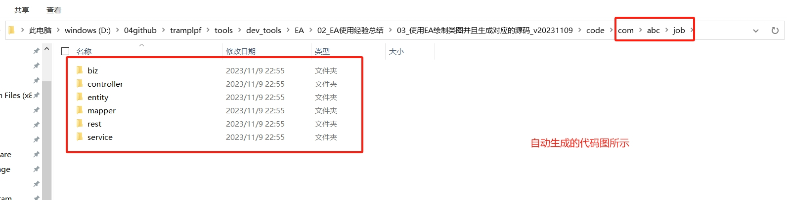

具体的代码细节如下

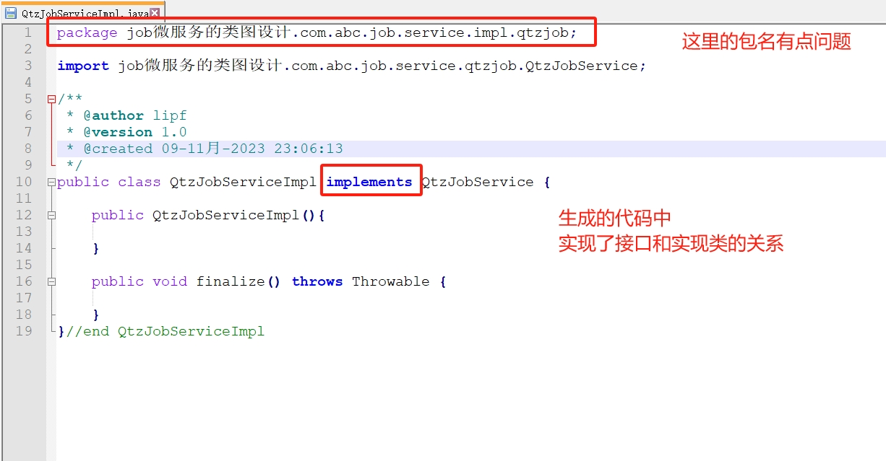

# 注意

按照上面的操作，生成的类的包名不对，因此，下次创建的时候，不要添加最外层的那个view。 

# 过程记录

| 日期       | 变更内容                     | 备注                                                         | 操作用户 |
| ---------- | ---------------------------- | ------------------------------------------------------------ | -------- |
| 2023-11-09 | EA创建类图，并且简单生成文件 | 后续还应该细化一下类和类之间的其他关系，以及嵌套内部类的设置 | lipf     |
|            |                              |                                                              |          |
|            |                              |                                                              |          |
|            |                              |                                                              |          |

