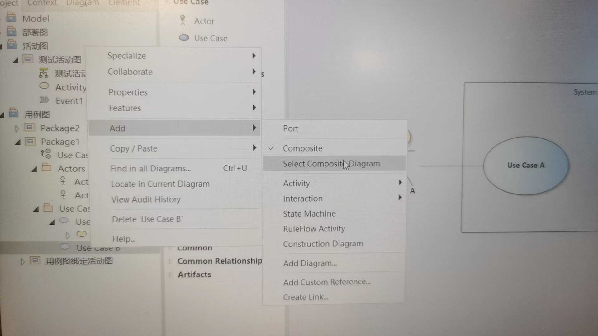
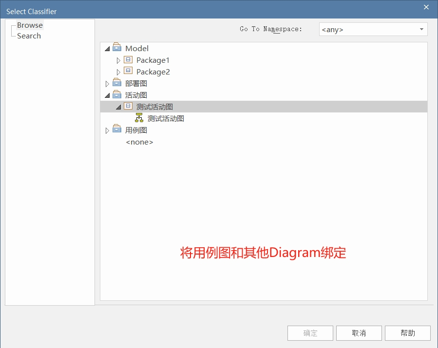
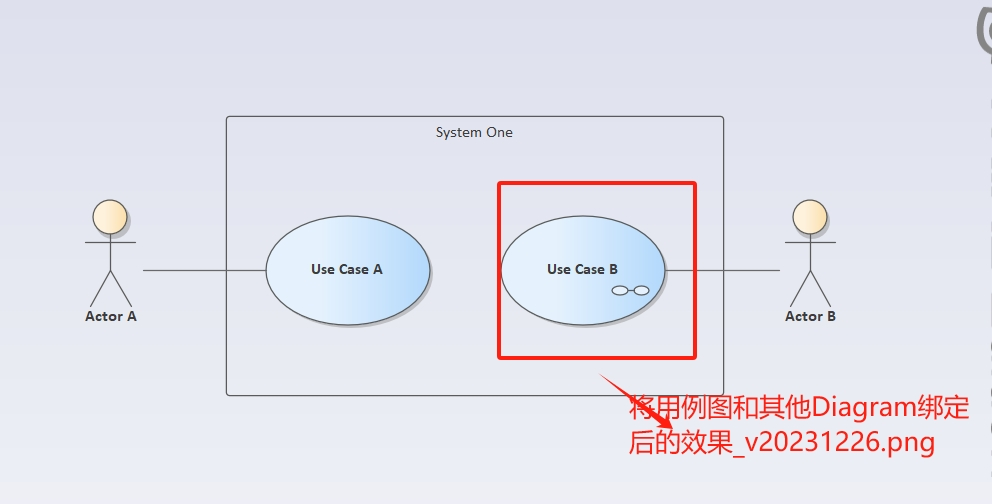
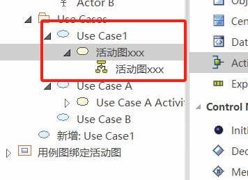
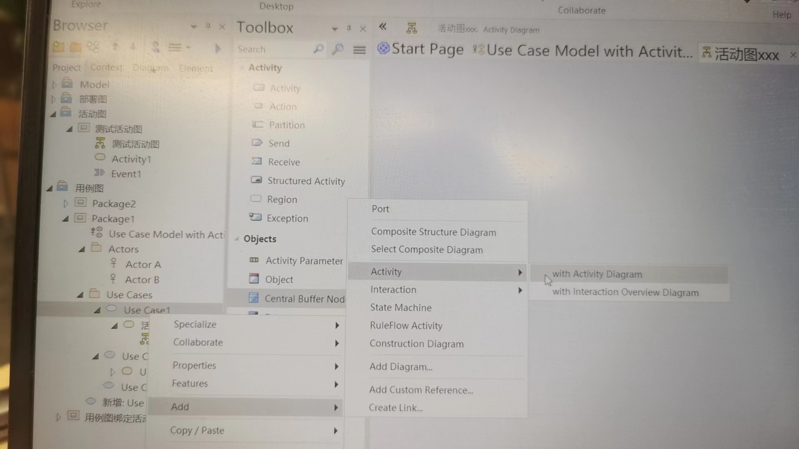
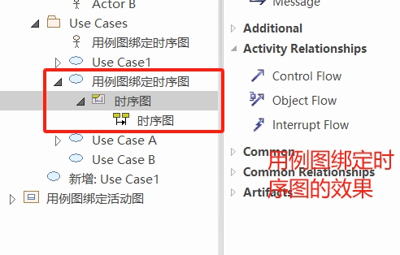

# EA中将用例图和其他UML图建立关系

在EA中可以为用例图建立起和其他UML图的关系， 选中要绑定的用例图，右键，选择【Add】 可以进行关系绑定。 

## 效果一：调整

**可以通过用例进行跳转**

和已经建立的UML图建立关联

1. 右击用例图--> [ADD] ->[Select Composit Diagram]. 

添加后，显示效果如下，此时，可以通过双击用例图跳转到对应的UML图。 

## 效果二：直接查看 

**在用例下可以直接找到对应的UML图**

