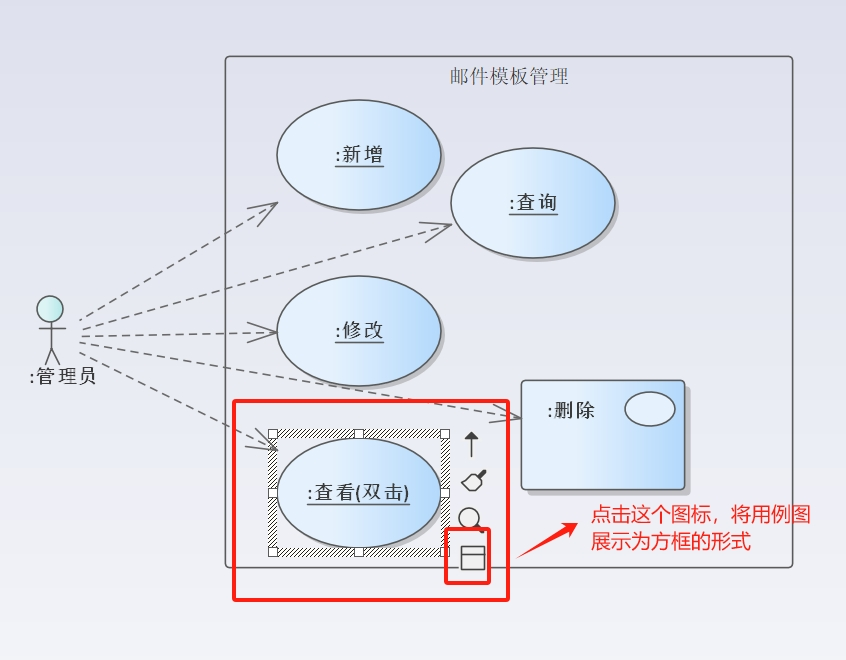
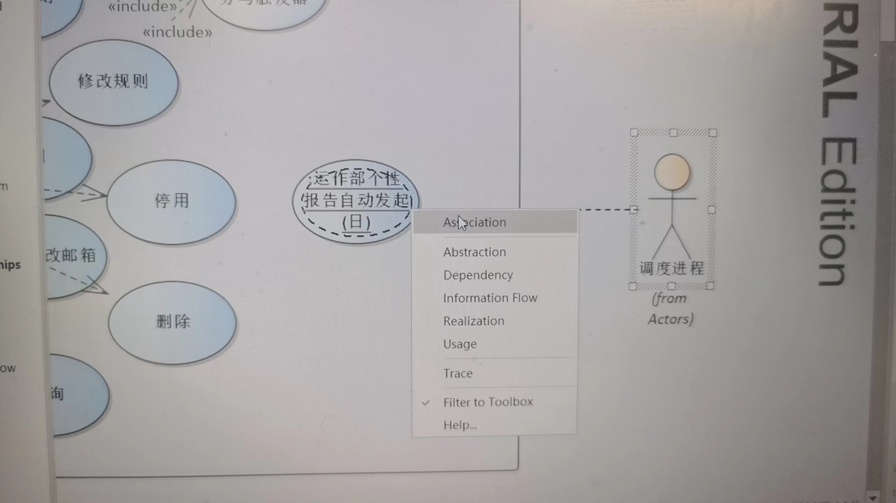
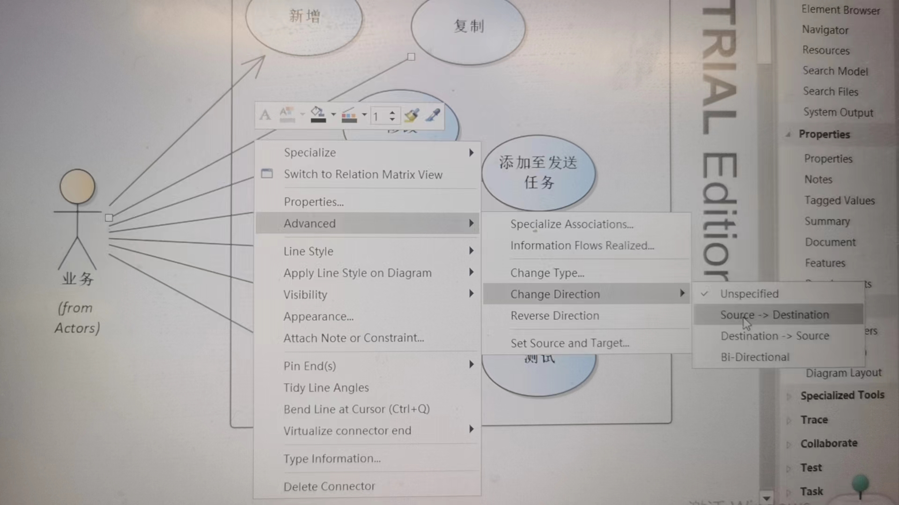

# 使用EA绘制UML之用例图(use Case)

### 设置用例的不同显示形式

使用EA绘制用例图，可以设置用例为不同的展示形式，目前支持椭圆和矩形。 

对于页面有多个地方触发，但是后台使用相关的代码，可以使用用例的link展示形式。 

### 用例图中设置连线为实线

连接用户和用例，选择Association，是一个没有箭头的直线，之后，选中直线，选中Advanced，来设置箭头方向。 

## 变更记录

| 日期              | 类型 | 操作内容         | 备注                                                         | 接下来验证的内容 | 操作用户 |
| ----------------- | ---- | ---------------- | ------------------------------------------------------------ | ---------------- | -------- |
| 2024-04-21 星期日 | C    | 使用EA绘制用例图 | 使用EA绘制用例图，可以对用例的展示形式进行调整，来区分不同类型的用例，比如椭圆表示业务操作，矩形表示开发需要专门进行开发(没有对应按钮) |                  | lipf     |
|                   |      |                  |                                                              |                  |          |
|                   |      |                  |                                                              |                  |          |
|                   |      |                  |                                                              |                  |          |

类型说明： C：创建    A： 最近内容    U：修改内容     R：解决疑惑点