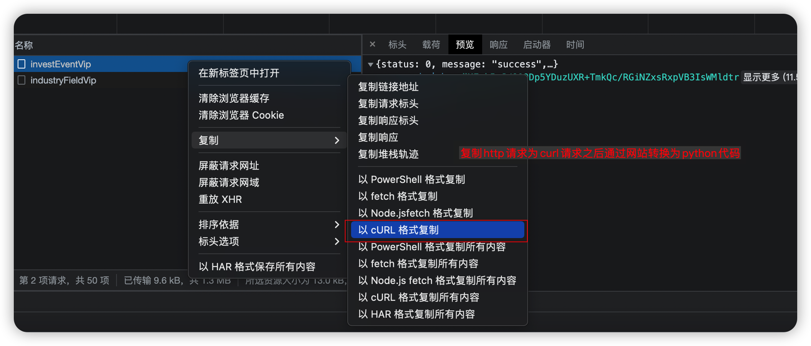
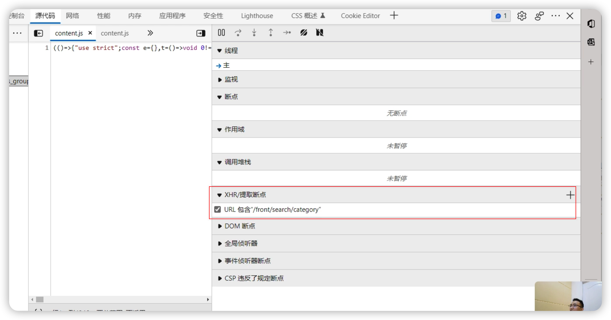
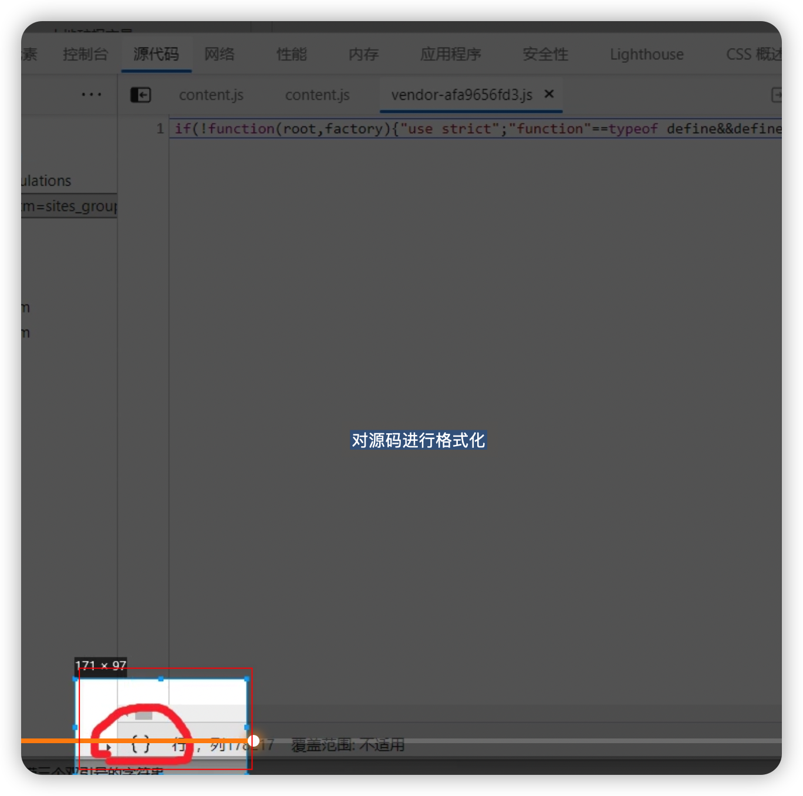

# Crhome 浏览器使用技巧


## 复制请求为curl 命令形式 
在浏览器的网络中，选中发送的请求，右键，可以选择不同形式的请求代码，如下图


之后可以将curl请求在 https://curlconverter.com 网站中转换为不同语言的请求代码 


```curl
 curl 'https://vipapi.qimingpian.cn/DataList/investEventVip' \
  -H 'Accept: application/json, text/plain, */*' \
  -H 'Accept-Language: en,zh-CN;q=0.9,zh;q=0.8' \
  -H 'Cache-Control: no-cache' \
  -H 'Connection: keep-alive' \
  -H 'Content-Type: application/x-www-form-urlencoded' \
  -H 'Origin: https://www.qimingpian.cn' \
  -H 'Pragma: no-cache' \
  -H 'Sec-Fetch-Dest: empty' \
  -H 'Sec-Fetch-Mode: cors' \
  -H 'Sec-Fetch-Site: same-site' \
  -H 'User-Agent: Mozilla/5.0 (Macintosh; Intel Mac OS X 10_15_7) AppleWebKit/537.36 (KHTML, like Gecko) Chrome/106.0.0.0 Safari/537.36' \
  -H 'sec-ch-ua: "Chromium";v="106", "Google Chrome";v="106", "Not;A=Brand";v="99"' \
  -H 'sec-ch-ua-mobile: ?0' \
  -H 'sec-ch-ua-platform: "macOS"' \
  --data-raw 'time_interval=&tag=&tag_type=&province=&lunci=&page=1&num=8&unionid=' \
  --compressed
```
转换成的Python代码如下：

```Python
import requests

headers = {
    'Accept': 'application/json, text/plain, */*',
    'Accept-Language': 'en,zh-CN;q=0.9,zh;q=0.8',
    'Cache-Control': 'no-cache',
    'Connection': 'keep-alive',
    'Origin': 'https://www.qimingpian.cn',
    'Pragma': 'no-cache',
    'Sec-Fetch-Dest': 'empty',
    'Sec-Fetch-Mode': 'cors',
    'Sec-Fetch-Site': 'same-site',
    'User-Agent': 'Mozilla/5.0 (Macintosh; Intel Mac OS X 10_15_7) AppleWebKit/537.36 (KHTML, like Gecko) Chrome/106.0.0.0 Safari/537.36',
    'sec-ch-ua': '"Chromium";v="106", "Google Chrome";v="106", "Not;A=Brand";v="99"',
    'sec-ch-ua-mobile': '?0',
    'sec-ch-ua-platform': '"macOS"',
}

data = {
    'time_interval': '',
    'tag': '',
    'tag_type': '',
    'province': '',
    'lunci': '',
    'page': '1',
    'num': '8',
    'unionid': '',
}

response = requests.post('https://vipapi.qimingpian.cn/DataList/investEventVip', headers=headers, data=data)
```


## 对请求接口进行校验

浏览器真实向后台发送的请求，可能和控制台【网络】中显示的在参数，请求方式等方面存在一些差异。 可以通过如下操作来获取真实请求信息。 

* 讲请求在【源代码】--》【XHR/提取断点】处添加要校验的请求的URI地址。


之后刷新页面，就会在发送该断点处停下来，之后，可以进行一步步调试，知道在【作用域】中出现请求相关的信息，就可以看到真实的请求参数以及请求方式了


## Chrome中对js代码进行格式化
在控制台的[源代码] 中，选中要格式化的源代码，选择左下角的 【{}】进行格式化，便于后续的操作。 
