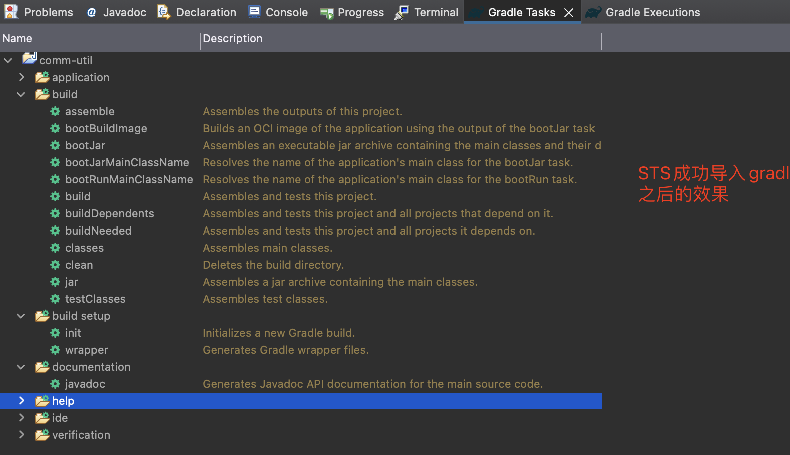
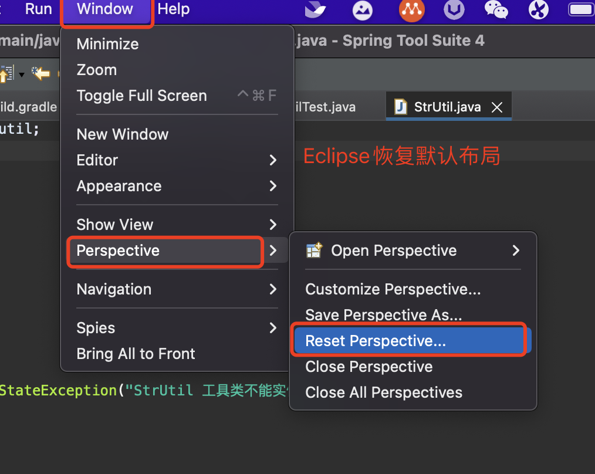
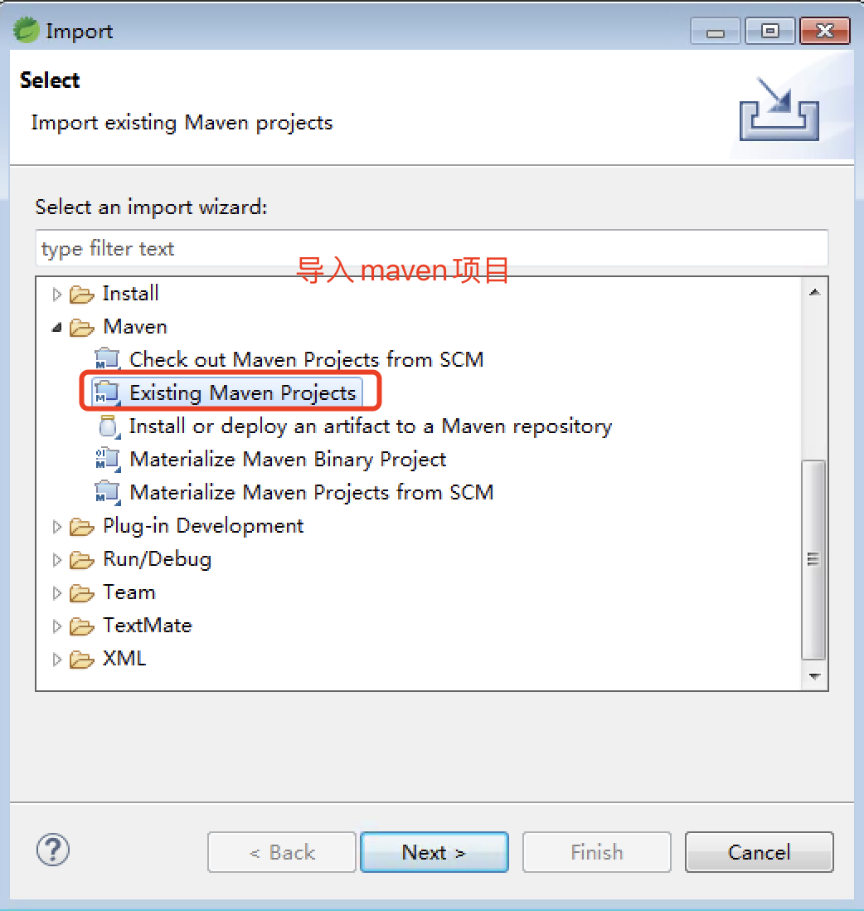
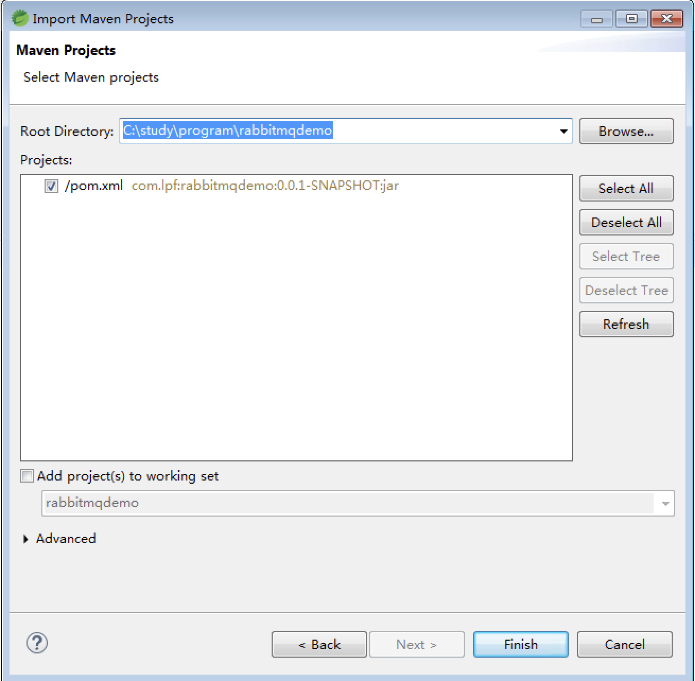
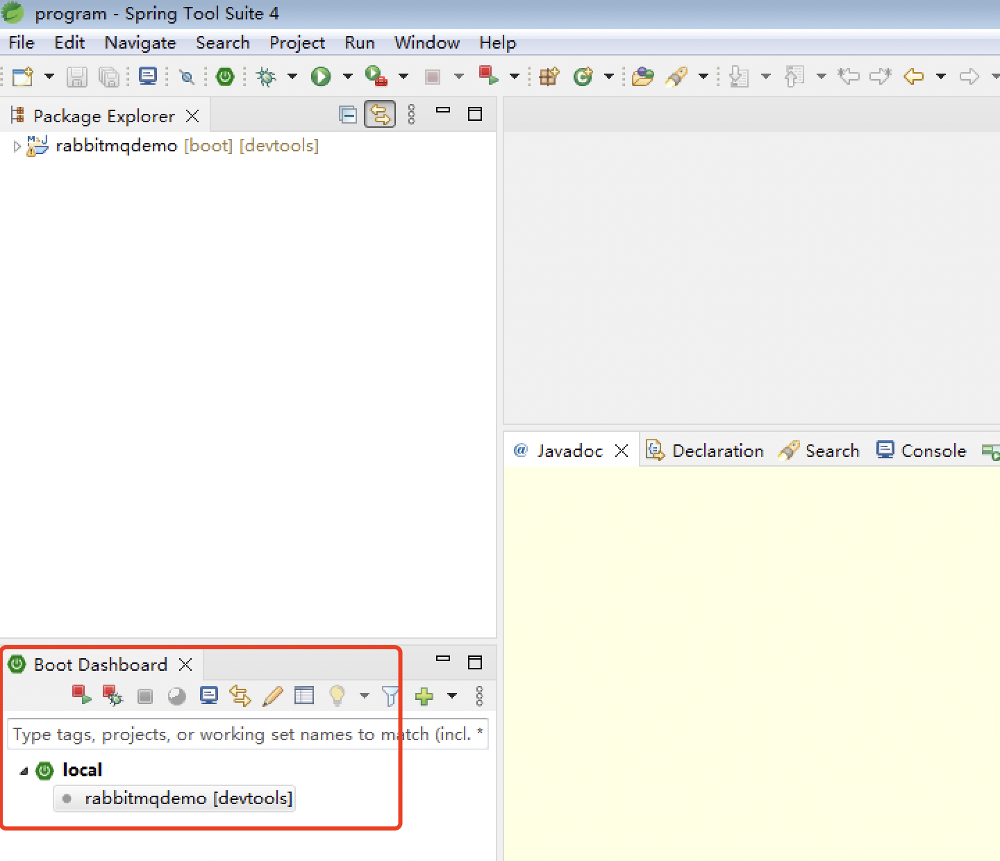
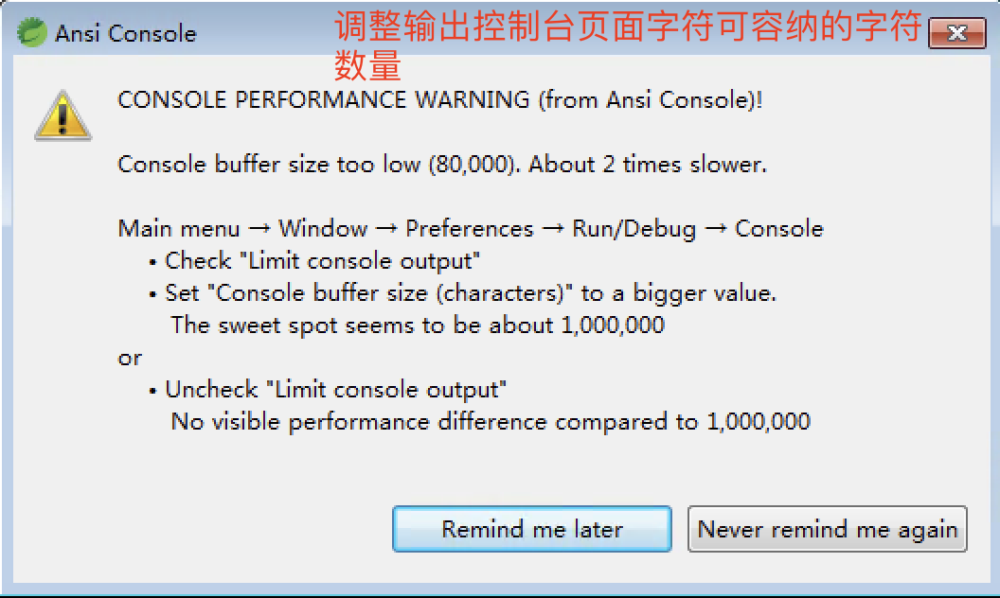

# Eclipse 开发工具使用

[TOC]

STS 是 springboot 官网提供的开发 springboot 项目的工具是以 Eclipse 为基础搭建的。

## 配置篇

## 快捷键篇

## 使用篇

1. ### STS 导入 gradle 项目

   

2. ### STS 恢复默认的布局

   Window----> Perspective--> Reset Perspective

   

3. STS导入并运行maven构建的SpringBoot项目

   ### 导入：

   ​		File--》import 在弹框中选择 maven项目

   ​		

   如下图

   ： 

   

   

   注意：在导入maven项目之前，需要配置好eclipse的maven地址配置，以及保证远程仓库和本地仓库都可以正常访问。 否则会导致maven导入之后，无法运行。

   ### 运行：

   ​		如下图，选中Boot Dashboard 中local下面的 rabbitmqdemo 项目名，之后，点击上方带有运行或者调试图标的红色按钮。

   

 4. STS中显示DashBoard来进行微服务的开发

    选中如图中的图标，

    

    会弹出Dash Board 面板进行微服务启动/停止的统一管理。

    如下图：

    

    

 5. Spring cloud 项目的展示

    

    不要选择Flat 的展示形式，否则效果会和下图一样：

    

## Eclipse 使用过程中的异常

1. 控制台可容纳字符个数太少

   ''

​		解决方案：按照上面的提示，取消字符限制即可。

