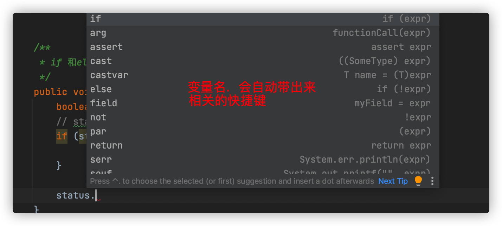
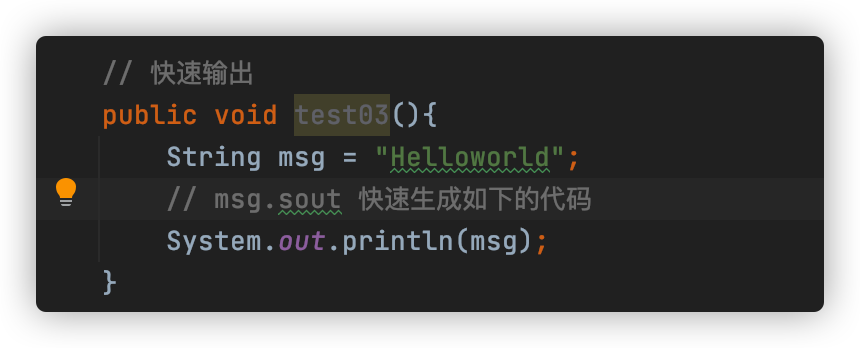
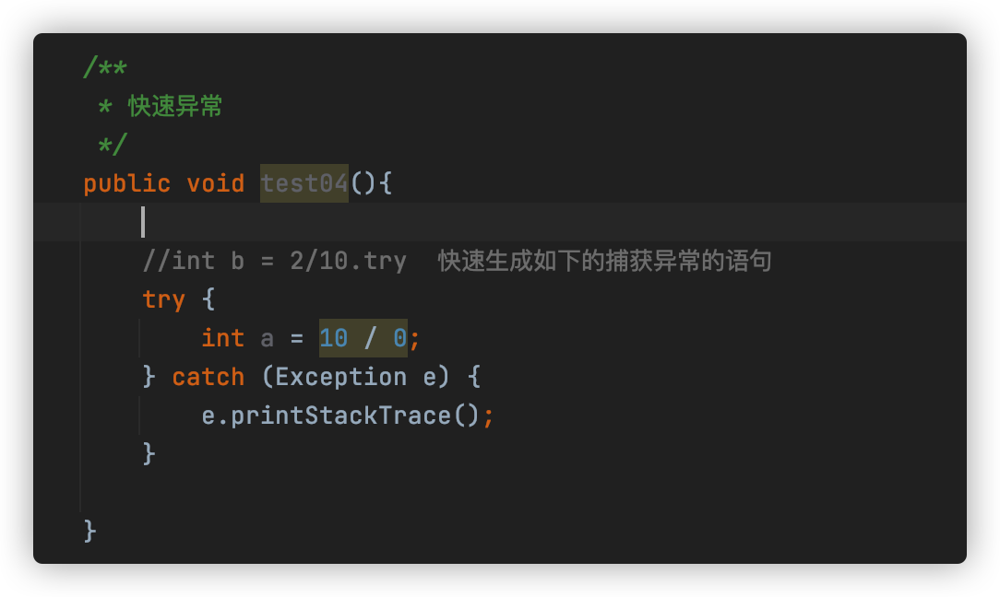
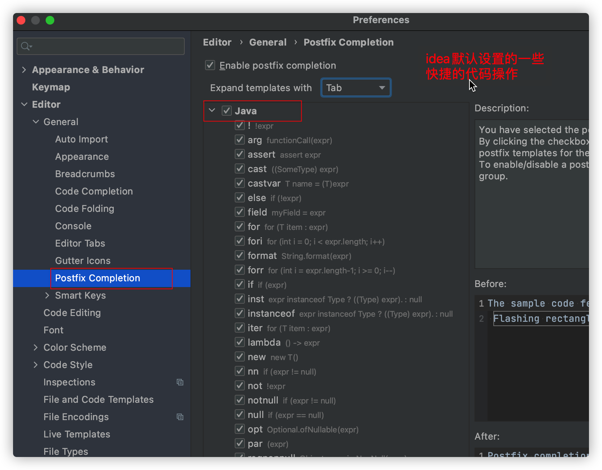

IDEA 中的快捷键
	CTRL + P 显示所有的类或者方法的同名的类型， 废弃的还划线
	ALT + ENTER 可以补全调用方法返回的类型。 
	CTRL + ALT + P  提取要写死的参数到方法参数 

	CTRL + ALT + M 抽取代码块新建一个方法
	DEBUG 模式下自动显示每个变量的值，还可以选中对某个表达式进行演示 （ALT + f8）。 
	
	local history 可以知道文件从创建到修改的每一次修改记录。 
	
	CTRL + SHIFT + ENTER 在当前行任何地方可以快速在末尾生成分号； 
	
	按两个SHIFT,输入文件夹名，可以跳转到具体的文件夹中。 

在 idea 里的每个操作，都可以看做是一个action， 我们可以使用ctrl + shift + a  来输入我们想要的操作。 比如说，可以先使用 ctrl + shift + a 快捷键， 然后输入 Rebuild project 并回车，就可以执行重新编译项目。 

idea 设置打开文件显示的tab 的个数：
在菜单中找到了调整方法，以Mac为例，调整路径为 “Intellij IDEA” -> "Perferences..." -> "Editor" -> "Editor Tabs"，调整 Tab Closing Policy 的 Tab Limit，默认是10个，修改为你需要的个数即可
将限制设置为1个，任何通过 Ctrl + E 来实现文件之间的切换。 (编写一个功能的时候，涉及到的文件不应该太多，太多，说明自己设计的代码有问题。)

在service中调用一个mapepr,通过mapper.new方法名(). 通过alt + enter，可以在对于的mappper里面生成相关的方法；
	

自动设置idea导入和删除无用的import 
	在属性设置中， Editor-> General---> Auto Import-->
	勾选： Add unambiguous import on the fly    表示 自动导入需要的import
    勾选： Optimize imports on the fly     表示自动将无用的import删除

## Mac 版

1. 快捷的编码方式

   	

    变量.  会给出相关的提示。

​		快速返回，快速输出

​		a.re  会带出提示信息，

​        a.sout 会快速打印变量a

  

  

快速异常

快速生成返回值

## Win版
