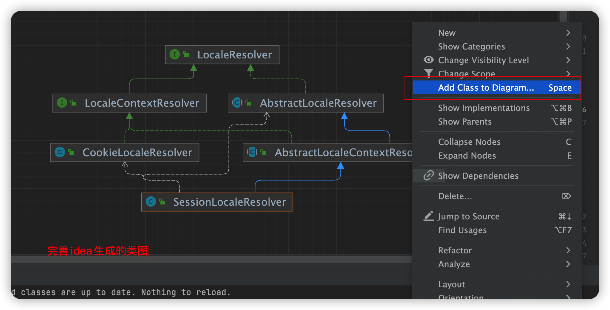

#009idea的使用技巧.md

##idea让某个项目支持某个框架(比如，让某个不支持maven的项目支持maven)
	操作：选中某个项目，然后右键，弹出的选项中，选择  Add Framework Support ，来添加想要引入的框架。 
如下图：

完善idea自动生成的类图

1. 添加一个相关的类。 

   右键--》 Add Class to Diagram 

   也可以直接通过快捷键 Space 来添加相关的类

