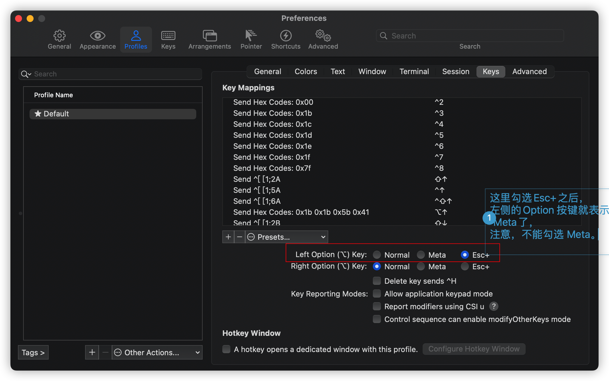
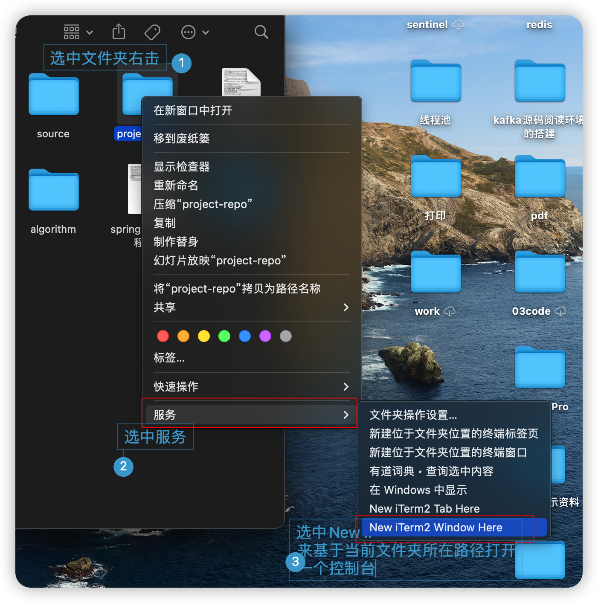
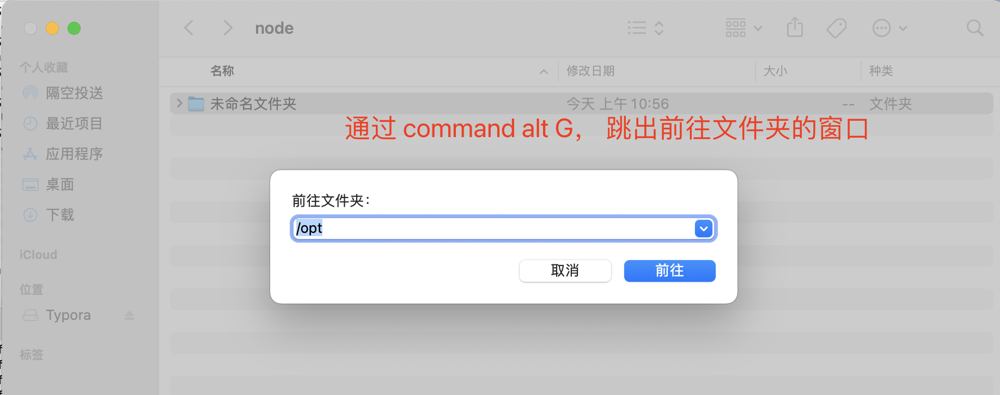

# Mac 笔记本使用经验


## 技巧

### Mac 系统查看端口被占用的问题

Mac系统通过lsof 命令查看端口被占用情况，相关命令如下
```shell
	$> lsof -i:端口号
```

执行该命令之后，可以看到指定端口被哪个应用占用，并且会显示相关的进程号。
之后就可以通过kill 命令指定进程号来杀死指定的进程。命令如下

```shell
	$> kill 进程号
```

### Itrem2 控制它中设置Meta 键

为了在iterm 中打开emacs之后，便于通过 meta-x 调用某个命令

步骤如下：

1. 打开偏好设置（command+,）
2.  选择 Profiles - Keys - General
3. 将Option键设置为`Esc+`，注意不要设置成`Meta`。

之前我设置成`Meta`键，在Shell和[Vim](https://so.csdn.net/so/search?q=Vim&spm=1001.2101.3001.7020)中不起作用，设置成`Esc+`才会起Meta键的作用。




### Mac 系统中给命令行设置别名

Mac系统针对shell的类型不同，设置别名的方式稍有差距
#### zsh
当mac系统的shell是ZSH的情况下，使用如下命令来设置临时的别名
```
	$> alias studyemacs='emacs /Users/lpf/github/tools/dev_tools/emacs/studyemacs.org'
```

通过这种方式设置的别名，只会当前会话中有效，如果希望对所有会话都有效，可以切换到当前用户所在目录（只需要一个cd 命令，不带任何参数就可以）。然后编辑 .zshrc文件
在文件最后一行，添加如下内容
alias studyemacs='emacs /Users/lpf/github/tools/dev_tools/emacs/studyemacs.org'

保存。

之后，执行source .zshrc 命令。
执行完之后，我们可以执行alias 命令查看系统中定义的所有别名

### Mac系统卸载软件后剩余图标的删除

```tsx
sqlite3 $(find /private/var/folders \( -name com.apple.dock.launchpad -a -user $USER \) 2> /dev/null)/db/db "DELETE FROM apps WHERE title='IntelliJ IDEA';" && killall Dock
```

### Mac系统基于某个文件夹所在路径快速打开一个终端



 	1. 选中目标文件夹右击
 	2. 选择【服务】
 	3. 选择【New iterm2 window Here】


## 其它

下载jdk 的有用的国内镜像
https://mirrors.tuna.tsinghua.edu.cn/AdoptOpenJDK/11/jdk/x64/mac/


使用mac 系统安装postman ：

```shell
$> brew  install postman
```

​		不过现在有了apifox可以替代postman。 


## 需要完善的地方

* mac系统可以支持其他类型的shell，他们设置别名的方式有所差异。需要总结一下，尤其是bash，
* 这里也没有列举出一些关于shell信息查看的命令，这一点需要改进


## Mac系统常用的快捷键

* commond+shift+G，跳出前往文件夹的窗口

  

* 


 1. 

    


## 变更记录

| 类型 | 时间       | 变更内容                                      |
| ---- | ---------- | --------------------------------------------- |
| 新增 | 2021-11-27 | mac中lsof和kill命令配合杀死占用某个端口的进程 |
| 新增 | 2021-11-27 | 新增mac系统如何为zsh设置别名                  |
| 新增 | 2022-04-05 | mac系统的iterm2控制它设置meta按键             |
|      |            |                                               |