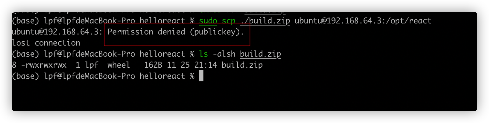

# Mac系统和其他Linux系统通信

这里为了方便说明，假定其他Linux系统为A系统。 


## 生成秘钥


## 系统间免密登录设置

切换到mac系统用户目录下的.ssh 目录下。将该目录下的id_rsa.pub 中的内容复制到A系统某个用户home目录下的.ssh目录下的authorized_keys文件中。 


**验证**

通过如下命令验证两个系统之间的免密访问是否设置成功

```shell
$> ssh ubuntu@192.168.64.3
```

如果登录成功的话，会自动登录到目标系统。


## 遇到的问题

* 通过scp命令传输文件的时候，权限不足

  Permission denied (publickey)

  


