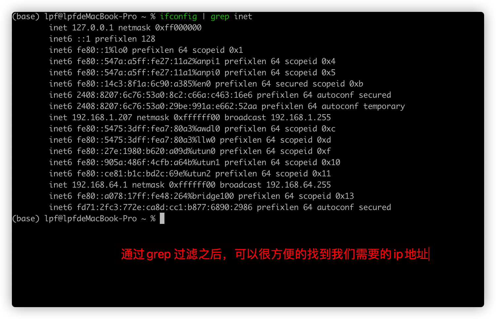

# Mac 系统网络相关的内容


## Mac系统查看本地ip地址

通过如下命令查看本地Ip地址

```shell
$> ifconfig 
```

显示效果如下


这里可能显示的网络信息很多，如果只是想知道ip地址，可以通过grep 命令来对显示结果进行筛选。

命令如下

```shell
$> ifconfig | grep inet
```

显示效果如下




## 变更记录

| 类型 |          时间          | 内容                              |
| :--: | :--------------------: | :-------------------------------- |
| 创建 | 2021年11月25日23:08:58 | mac系统通过ifconfig查找本地ip地址 |
|      |                        |                                   |
|      |                        |                                   |
|      |                        |                                   |
|      |                        |                                   |

