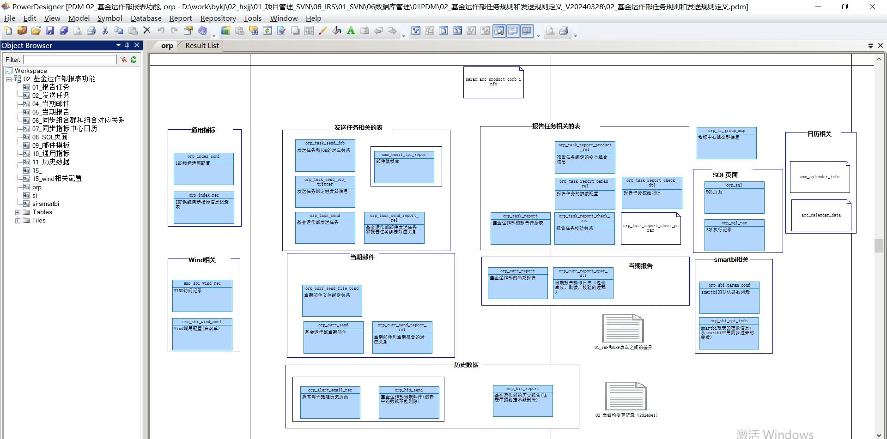
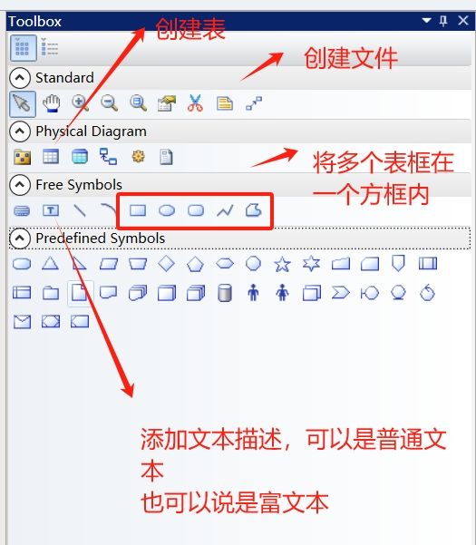
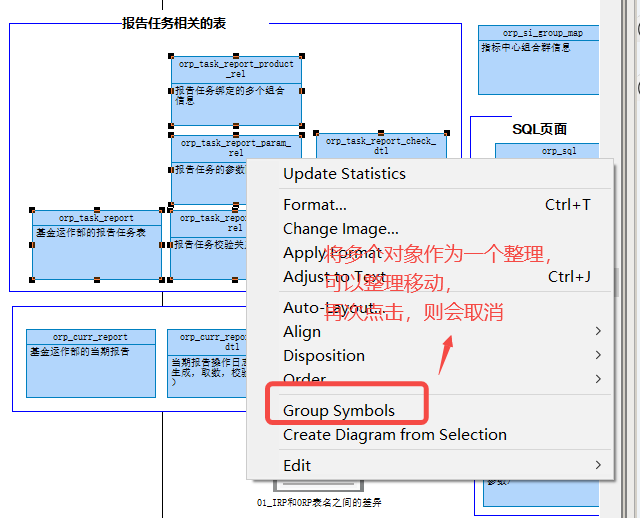
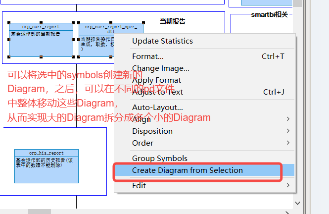
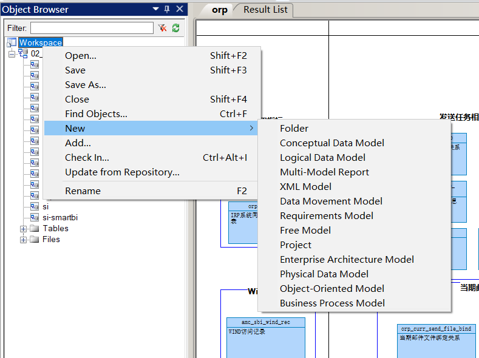
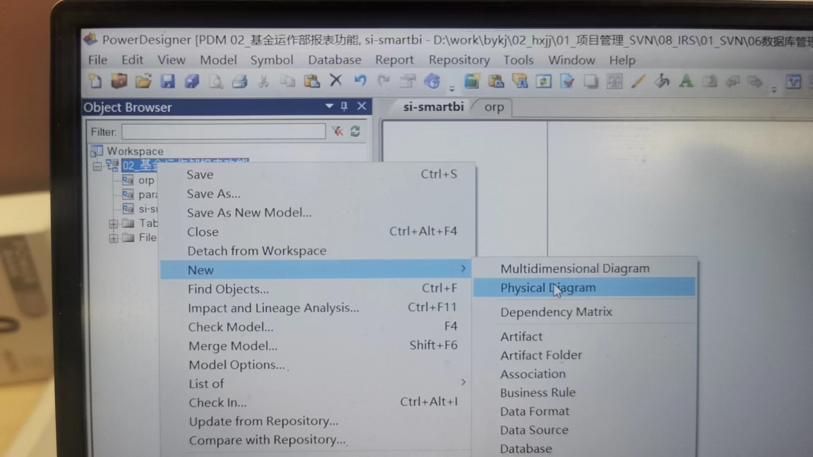
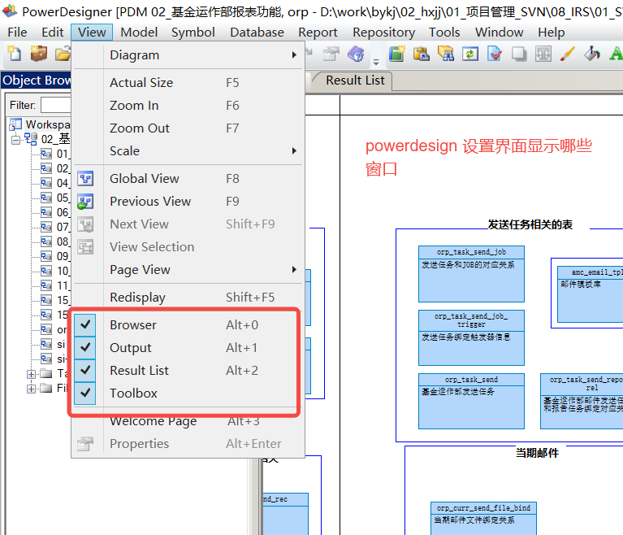

# PowerDesign使用入门

**效果图**

我们使用powerdesign进行建模的时候，可以创建多个不同的Diagream。 

## 工具栏Toolbox介绍

## 其它

将多个图形作为一组

## 拆分大的Diagram为小的Diagram并且保持到不同的文件中

在将一个大的Diagram按照模块拆分成多个小的Diagram之后，可以新建新的模型，然后将拆分出来的小模型拖到新建的模型文件中，从而实现文件的拆分。 最后他们保持在各自的文件中，可以分配给不同的开发人员开发不同的组件(模块)。 

## powerdesign支持的模型

## 创建新的Diagram

## 设置界面显示那些窗口

