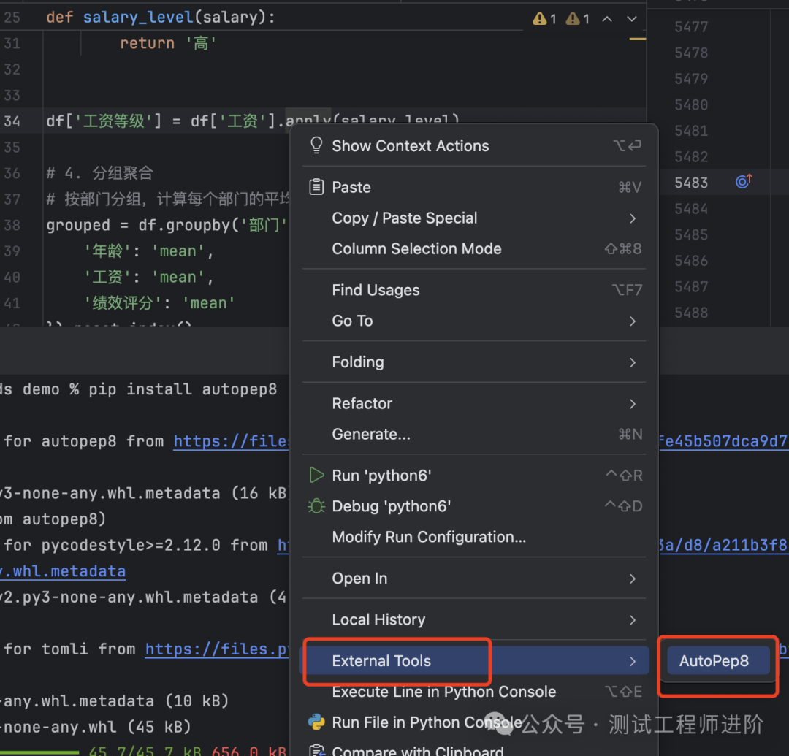
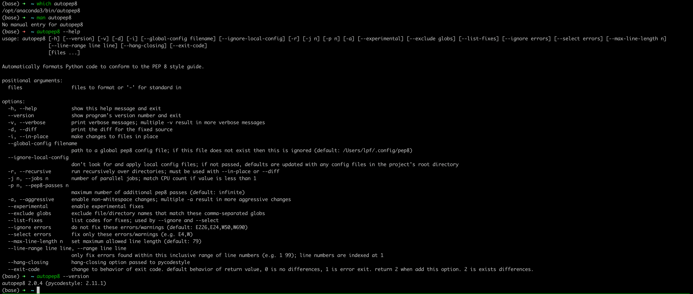

# Pycharm使用技巧


## 自动格式化代码AutoPep8

Autopep8 是一个基于Python的代码格式化工具，可以按照PEP8编码规范对Python源代码进行格式化，优化，似的代码更加整洁美观。

### 配置

PEP8是Python官方发布的编码桂发，旨在提高代码的可读性和一致性。 

```shell
$> pip3 install autopep3
```

pycharm配置autopep8

```text
菜单--> Setting--> Tools---External Tools ---> 点击+添加工具
```

配置信息如下：

```text
Name: 名称可以随意Program: autopep8        # 前提必须先安装Arguments: --in-place --aggressive --aggressive $FilePath$Working directory: $ProjectFileDir$Advanced OptionsOutputfilters:$FILE_PATH$\:$LINE$\:$COLUMN$\:.*
```

TODO : 参数使用还需要完善

### 使用



### autopep8的语法




