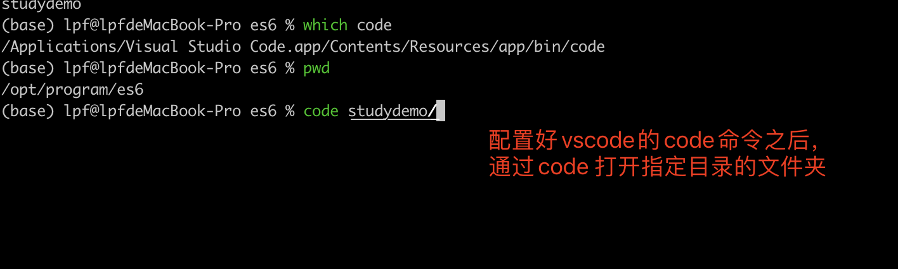

## Mac环境中将Vscode的路径配置到PATH路径下

先切换到root用户下，使用 如下命令查找到code 命令

```shell
$>  find / -name code
```

找到vscode 的code 命令的路径：      

```txt
/Applications/Visual Studio Code.app/Contents/Resources/app/bin/code
```

之后在/etc/profile 中配置code到PATH路径下， 配置代码如下

```/etc/profile
 # for vscode
 export PATH=$PATH:"/Applications/Visual Studio Code.app/Contents/Resources/app/bin"
```

这里需要注意，因为code命令所在路径有空格，所以这里要通过双引号来将路径包装一下

执行如下命令来刷新

```shell
$> source /etc/profile
```

### 验证配置是否成

启动命令后工具，在任何路径下输入code， 都可以打开 vscode


### 高级应用

也可以通过code 命令直接打开指定的文件夹或文件




## 变更记录

| 类型 | 时间              | 内容                                                        |
| ---- | ----------------- | ----------------------------------------------------------- |
| 新增 | 2021-12-04 星期四 | 在Mac系统安装vsocde后配置在命令行中通过命令code来启动vscode |
|      |                   |                                                             |
|      |                   |                                                             |

