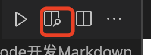

# Vscode使用技巧汇总

[TOC]

## VsCode编辑不同的语言
### VsCode开发Markdown
VsCode 默认可以支持markdown 文档的编辑，不过默认的显示效果可能不是太好看（例如，无法将[TOC]渲染为目录），这种情况下，可以借助 Markdown Preview Enhanced 查看来完善markdwon文件的渲染。

安装好Markdown Preview Enhanced 插件之后，编辑好markdown文档之后，可以通过右上角的相关图标来进行转换。

安装 Maridown pdf 插件可以将markdown 文档转换为其他格式的文件，例如pdf， html，png等格式
    安装好之后，右键即可使用。  在第一次使用的时候，会下载一下其他依赖。 生成的文件和原文件在同一个目录下。 
    该插件对[TOC] 标题的展示支持的不太友好。
    通过doctoc生成的目录，在生成对应的pdf时，目录也会显示出来
